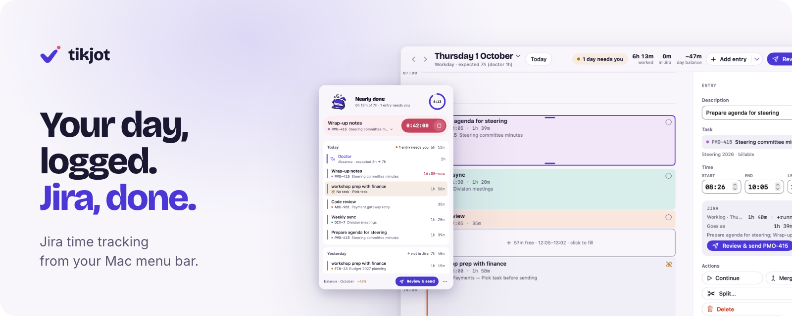

<picture>
  <source media="(prefers-color-scheme: dark)" srcset=".github/readme/hero-dark.png">
  
</picture>

# tikjot

**Jira time tracking from your Mac menu bar.** Start a timer with one click, fix your day like a calendar,
and send one tidy worklog per task and day to Jira. Only when you press Send.

> **tikjot is in private beta.** Signed beta releases appear under [Releases](https://github.com/rashowall/tikjot/releases)
> and the app updates itself from there. The full source code (GPL-3.0) will be published here at launch.
> More at [tikjot.com](https://tikjot.com).

- Free, for macOS 14 Sonoma or later. Jira Cloud and Data Center.
- No server, no telemetry. Your data stays encrypted on your Mac and goes only to your Jira.

Found a bug? [Open an issue](https://github.com/rashowall/tikjot/issues/new/choose). A security problem? See [SECURITY.md](SECURITY.md).

Jira and Atlassian are trademarks of Atlassian; Mac and macOS of Apple Inc. tikjot is an independent project,
not affiliated with or endorsed by either. The name tikjot, its logo and illustrations are reserved.
